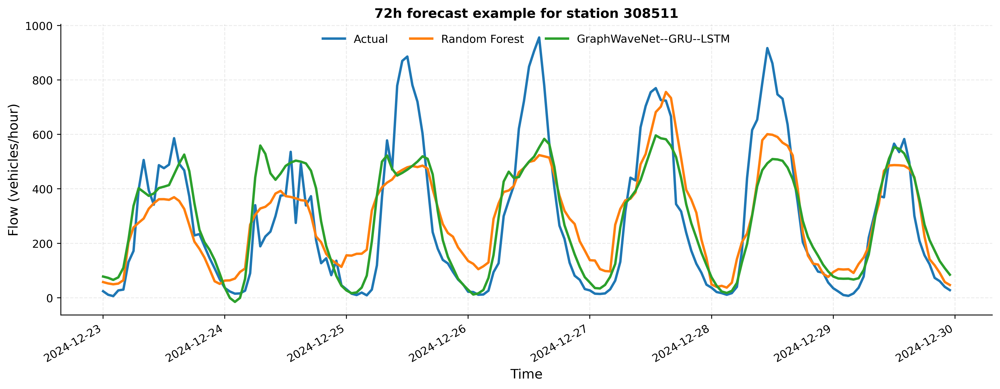

<h1 align="center">Hi, I'm Richel Attafuah</h1>

  <b> MSc Statistics alumna of Miami University </b> 
  Building machine learning &amp; time-series solutions for <b>transportation</b>, <b>energy</b>, and <b>public health</b>.

  
  
  
  
  

---

## Focus Area

I work at the intersection of **time-series forecasting** and **applied machine learning**, turning spatial and temporal data into decisions that matter for real systems. My research connects **traffic dynamics, energy demand, and population health**, with an emphasis on:

- **Forecasting & statistical modeling** — SARIMA, TBATS, hierarchical reconciliation, deep sequence models
- **Spatio-temporal modeling** — coupling spatial structure with temporal demand
- **Applied ML & deep learning** — model evaluation, deployment, and data-driven decision-making
- **Reproducible research** — clean, scalable pipelines in Python and R

---

## Featured Projects

### Spatio-Temporal Prediction & Coordination of EV-Charging Demand for Power-System Resilience

  

72-hour forecast example — Actual vs. Random Forest vs. GraphWaveNet–GRU–LSTM (real project output)

> Predicting *when* and *where* EV charging demand will arise by fusing spatio-temporal traffic features with deep learning — to support coordinated charging and a more resilient grid.

<!-- TODO: replace with your demo video/GIF. Drag a .mp4 into a GitHub issue to get a hosted URL,
     or commit a demo.gif and reference it like:  -->

  

- **Connects traffic dynamics with EV energy consumption** to anticipate charging needs in real time
- Integrates **traffic flow, speed, and spatial patterns** into deep learning models for demand prediction
- Lays the foundation for **coordinated charging strategies** that improve grid stability and EV integration in smart cities
- Designed as a **scalable, reproducible framework** for robust prediction systems

**Repo:** [Spatio-Temporal-Prediction-and-Coordination-of-EV-Charging-Demand](https://github.com/RichelCode/Spatio-Temporal-Prediction-and-Coordination-of-EV-Charging-Demand-for-Power-System-Resilience)

**Stack:** `Python` · `Deep Learning` · `Spatio-Temporal Modeling` · `Time Series` · `Jupyter`

 

### Coherent Hourly Traffic-Flow Forecasting — Hierarchical Modeling & Reconciliation (R)

  

Photo: <a href="https://unsplash.com/photos/aerial-view-of-a-highway-with-heavy-traffic-3FfoA-5IsA8">Unsplash</a>

> Forecasting hourly traffic flow with **hierarchical time-series reconciliation**, so forecasts stay coherent across aggregation levels.

<!-- TODO: replace with your demo video/GIF -->

  

- Builds a **hierarchy of traffic-flow series** and reconciles forecasts for consistency across levels
- Compares forecasting approaches for **hourly, multi-seasonal** demand
- Emphasizes **statistical rigor and reproducibility** in R

**Repo:** [Coherent-Hourly-Traffic-Flow-Forecasting](https://github.com/RichelCode/Coherent-Hourly-Traffic-Flow-Forecasting-Hierarchical-Modeling-and-Reconciliation-in-R)

**Stack:** `R` · `Hierarchical Time Series` · `Forecast Reconciliation` · `Statistics`

 

### Multi-Seasonal Forecasting of NYC Bike Demand — SARIMA vs TBATS vs Fourier-ARIMA

  

Photo: <a href="https://unsplash.com/photos/a-row-of-bicycles-parked-next-to-each-other-lVMvu8I8FsA">Unsplash</a>

> A head-to-head comparison of **multi-seasonal forecasting methods** on NYC bike-share demand.

<!-- TODO: replace with your demo video/GIF -->

  

- Benchmarks **SARIMA, TBATS, and Fourier-ARIMA** on real urban-mobility data
- Handles **multiple overlapping seasonalities** (daily + weekly cycles)
- Reports model evaluation to guide method selection for demand forecasting

**Repo:** [Multi-Seasonal-Time-Series-Forecasting-of-NYC-Bike-Demand](https://github.com/RichelCode/Multi-Seasonal-Time-Series-Forecasting-of-NYC-Bike-Demand-SARIMA-vs-TBATS-vs-Fourier-ARIMA)

**Stack:** `R` · `SARIMA` · `TBATS` · `Fourier-ARIMA` · `Time Series`

---

## Recognition

- **2nd Runner-Up — StatsBank Hackathon**
- **First Class Honors Graduate** · 2nd Overall Outstanding Student Award (University of Ghana)
- **ENAR Travel Award** · Diversity Mentorship Program Travel Award · PharmaSUG Award
- **Lilly Leadership Institute (Cohort 14)** — first graduate student selected across Miami University
- **Women in Statistics and Data Science Conference 2025** — presented spatio-temporal forecasting research
- **Published in *Scientific African* (2024)** — [stochastic population growth model](https://www.sciencedirect.com/science/article/pii/S2468227624003831) for national health & labor planning in Ghana

---

## Teaching & Community

- **Graduate Teaching Assistant, STA 261 (Miami University)** — supported 310+ students; weekly R & JMP labs, office hours averaging 15+ visits
- **AI & Student Project Development Faculty Learning Community** — integrating AI tools into teaching across disciplines
- **Social Media & Communications Lead, WiMLDS Accra** — amplifying opportunities for women in AI & ML
- **Technical writer on [Medium](https://medium.com/@richelattafuah)** — Python, ML, and data science career content
- **[YouTube channel](https://www.youtube.com/@richelattafuah23)** — Python & data science (68% avg watch-through, well above platform average)

---

## Tech Stack

---

## GitHub Activity

  
  

  

<i>Forecasting the future, one time step at a time.</i>

