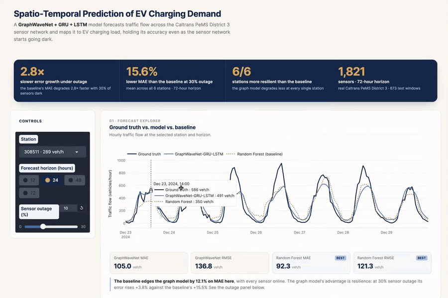
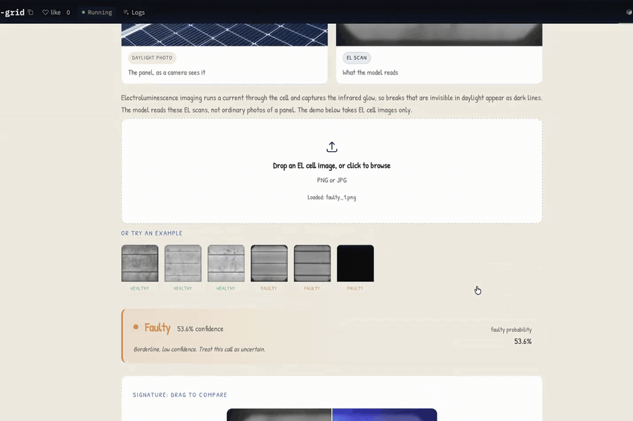

<h1 align="center">Hi, I'm Richel Attafuah </h1>

  <b>AI/ML Engineer &amp; Data Scientist</b> 
  I build ML systems that hold up outside the notebook. 
  <i>Richel makes tech easy.</i>

  
  
  
  
  
  

---

## Featured Projects

### Spatio-Temporal Prediction of EV Charging Demand

  

Forecasts traffic flow **72 hours ahead across 1,821 Caltrans PeMS sensors** and maps it to EV charging load. The point isn't the clean-data score. It's what happens when the network degrades: **with 30% of sensors offline, the model holds 15.6% lower MAE than a Random Forest baseline, and stays more resilient at all 6 stations.** The baseline's error grows **2.8× faster** as sensors go dark, because the graph reconstructs a dead node from its neighbours while the baseline only sees a dead channel.

**Method:** GraphWaveNet encoder + GRU/LSTM refinement over an adaptive adjacency matrix, evaluated at 12/24/48/72 h horizons, with up to **9.8% MAE improvement** over the base GraphWaveNet at long horizons.

  
  
  

**Stack:** `Python` · `PyTorch` · `GraphWaveNet` · `GRU / LSTM` · `Spatio-Temporal Graphs` · `NumPy` · `Gradio`

 

### Reading the Grid: Solar-Cell Fault Detection

  

Catches **85.4% of faulty solar cells** from electroluminescence scans (84.8% accuracy on a held-out split of 394 cells), and shows you *where* it looked: a Grad-CAM heatmap you drag against the original, so an inspector can confirm the call instead of trusting a bare label. Recall is prioritized over precision (71.4%) on purpose, because a fault missed in the field costs far more than a false alarm a human waves off in review.

**Method:** ImageNet-pretrained ResNet18, fine-tuned on the ELPV dataset with a class-weighted loss. Unfreezing the last residual block lifted faulty recall from **0.72 to 0.85**. Ships as a single Docker container: a FastAPI inference server behind a React front end, deployed on Hugging Face Spaces.

  
  

**Stack:** `PyTorch` · `ResNet18` · `Grad-CAM` · `FastAPI` · `React` · `TypeScript` · `Docker` · `Hugging Face Spaces`

---

## Other Work

- **Coherent Hourly Traffic-Flow Forecasting**: hierarchical modeling &amp; reconciliation in R, keeping forecasts coherent across aggregation levels · [repo](https://github.com/RichelCode/Coherent-Hourly-Traffic-Flow-Forecasting-Hierarchical-Modeling-and-Reconciliation-in-R)
- **Multi-Seasonal Forecasting of NYC Bike Demand**: SARIMA vs TBATS vs Fourier-ARIMA on overlapping daily/weekly seasonalities in R · [repo](https://github.com/RichelCode/Multi-Seasonal-Time-Series-Forecasting-of-NYC-Bike-Demand-SARIMA-vs-TBATS-vs-Fourier-ARIMA)
- **Published in *Scientific African* (2024)**: stochastic population growth model for national health &amp; labor planning in Ghana · [paper](https://www.sciencedirect.com/science/article/pii/S2468227624003831)

---

## Recognition

- **2nd Runner-Up, StatsBank Hackathon**
- **First Class Honors Graduate** · 2nd Overall Outstanding Student Award (University of Ghana)
- **ENAR Travel Award** · Diversity Mentorship Program Travel Award · PharmaSUG Award
- **Lilly Leadership Institute (Cohort 14)**: first graduate student selected across Miami University
- **Women in Statistics and Data Science Conference 2025**: presented spatio-temporal forecasting research
- **Published in *Scientific African* (2024)**: [stochastic population growth model](https://www.sciencedirect.com/science/article/pii/S2468227624003831) for national health & labor planning in Ghana

---

## Teaching & Community

- **Graduate Teaching Assistant, STA 261 (Miami University)**: supported 310+ students; weekly R & JMP labs, office hours averaging 15+ visits
- **AI & Student Project Development Faculty Learning Community**: integrating AI tools into teaching across disciplines
- **Social Media & Communications Lead, WiMLDS Accra**: amplifying opportunities for women in AI & ML
- **Technical writer on [Medium](https://medium.com/@richelattafuah)**: Python, ML, and data science career content
- **[YouTube channel](https://www.youtube.com/@richelattafuah23)**: Python & data science (68% avg watch-through, well above platform average)

---

## Tech Stack

---

## GitHub Activity

  
  

  

<i>Forecasting the future, one time step at a time.</i>

